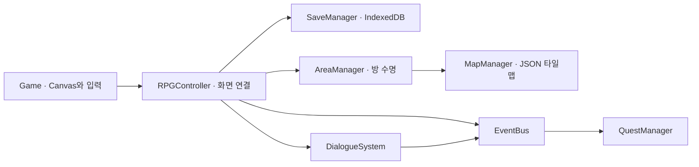

# 여월의 밤 · RPG 아키텍처 v5

현재 콘텐츠는 **6개 시대, 연결 방 24개, 의뢰 20개, 선택 캐릭터 2명**입니다. 기존 박물관 정화 시나리오와 전투를 유지하고 장기 진행 데이터를 별도 계층으로 분리했습니다. 수십 시간 분량의 완성된 상용 콘텐츠나 실제 기기 성능 검증까지 완료했다는 의미는 아닙니다.

## 모듈 경계



- `js/core/EventBus.js`: 구독 해제 함수를 반환하는 이벤트 버스와 Scope.
- `js/rpg/SaveManager.js`: 슬롯 1~3, 스키마 검증, 직렬화한 스냅샷, SHA-256, 쓰기 큐, 트랜잭션 완료 후 성공 응답.
- `MapManager.js`: 32×18 타일 그리드의 동적 로드, 최대 4개 맵 LRU 캐시, 충돌·회피 이동·투사체 선분 검사·적의 우회 경로.
- `AreaManager.js`: 다음 맵을 먼저 검증한 후 페이드, 이전 상태 캡처, Scope 해제, 런타임 정리, 새 방 설치. 로드 실패 시 현재 방 유지.
- `QuestManager.js`: `all` / `any` / 플래그 조건 트리와 선행 의뢰. 선행 의뢰를 완료하기 전에 발견한 단서도 집계하며 보상은 한 번만 지급.
- `DialogueSystem.js`: 노드와 선택지 기반 대화, 선택 플래그 기록, 낮/밤이 포함된 대화 이벤트.
- `RPGController.js`: 기존 전투와 도메인 모듈을 연결하는 어댑터. 슬롯·캐릭터·지도·대화·의뢰·가방 UI, 체크포인트와 캠페인 수명 관리.
- `js/data/campaign.js`: 캐릭터 수치, 의뢰 정의, 대화 데이터. `data/maps/`: 런타임 JSON 24개.

일반적인 이벤트 페이로드는 `{type, target, phase, amount?}`입니다. 타입은 `kill`, `collect`, `switch`, `talk`, `choice`, `visit`, `boss`입니다. 도메인 모듈은 DOM이나 Canvas를 직접 참조하지 않습니다. 화면 연결만 RPGController가 맡습니다.

## 저장

IndexedDB `yeowol-rpg`, 버전 1, object store `slots`, keyPath `slot`입니다. 레코드에는 JSON·SHA-256·수정 시각·캐릭터·회차·플레이 시간·위치를 저장합니다. 트랜잭션이 중단되면 이전 레코드가 유지됩니다. 새 여정/외부 백업 가져오기는 `add`를 사용해 기존 슬롯 덮어쓰기를 방지합니다.

JSON에는 위치와 스폰, 좌표와 스탯·회복약, 인벤토리, 무기와 장착 유물, 열린 문·스위치·처치 ID·방문·수집·대화 선택, 방별 적 HP/위치·퍼즐·드롭, 퀘스트 카운트와 완료 여부, 박물관 복원도, 회차를 기록합니다. 투사체, 애니메이션 순간 상태, DOM 핸들은 저장하지 않습니다. 불러올 때 생명 상한과 공격력은 캐릭터·복원도·장착 유물로 다시 계산합니다.

안내 데스크 귀환과 텐트 진입 시 자동 저장합니다. 대화 보고·복원 등의 영구 변경도 저장합니다. 사망 시 마지막 체크포인트를 불러오며, 전투 중 새로고침으로 체크포인트 이후 진행이 보존되지는 않습니다. 저장 실패는 화면에 표시하고 성공으로 간주하지 않습니다. IndexedDB는 용량이 무한하지 않으며 사이트 데이터 삭제/앱 제거 시 소실될 수 있습니다.

가방에서 JSON 백업을 내보내고 빈 슬롯에서 가져올 수 있습니다. 기존 localStorage v2 기록은 빈 슬롯의 **이전 버전 기록 가져오기**로 정화/파편/복원/단서를 복사합니다. 이전 버전에 없던 맵과 퀘스트는 새로 시작하며 원본 localStorage는 지우지 않습니다. SHA-256은 우발적 손상 검출용이며 부정행위 방지나 인증 서명이 아닙니다.

## 탐험과 회차

각 시대는 `entry → gallery → sanctum`과 `gallery → archive`로 연결됩니다. entry는 안전한 텐트, gallery는 적과 스위치, sanctum은 기존 퍼즐·보스, archive는 능력 게이트 너머의 기억 원본입니다. 스위치를 켜야 보스실로, 해당 유물을 얻어야 기록실과 다음 시대로 이동할 수 있습니다. 최종 기록실은 졸업의 증표를 사용합니다. 가까이에서 **E/조사**로 이동하며 스폰 매핑과 페이드가 적용됩니다. 지도에서 발견한 텐트로 귀환할 수 있습니다.

보스는 해당 회차에서 다시 생성하지 않습니다. 6개 구역 정화 후 가방에서 다음 회차를 시작할 수 있습니다. 확인 후 현재 슬롯의 월드·퀘스트·능력을 초기화하고 캐릭터·복원도·정산 파편·장착 유물을 계승합니다. 적과 보스 생명은 회차마다 25% 증가합니다. 추가 콘텐츠 제작 시 JSON 방과 퀘스트 정의를 확장하고 스키마의 방 ID 검증/지도 UI도 함께 갱신해야 합니다.

## 수명 관리

방을 나가면 적·투사체·위험 지대·드롭·효과·노드를 해제합니다. 방 전용 이벤트는 Scope.dispose로 해제하고 로드 취소에는 AbortController와 전환 세대를 사용합니다. Game, TouchInput, MobileDisplay에는 dispose가 있어 전체 인스턴스 종료 시 RAF·전역 이벤트·입력 캡처·오디오를 정리합니다. 플레이 중에는 Game 인스턴스 하나를 재사용합니다.

## C# 오프라인 백업

`dotnet/SaveDataCompressor.cs`는 JSON을 GZip 압축하고 원본 UTF-8 데이터의 SHA-256을 버전이 있는 JSON 봉투에 기록합니다. 압축 해제 시 해시와 JSON 형식을 검증하고 압축 전후 16 MB 한도를 적용합니다. 별도 클라우드 서버나 인증·동기화 API는 연결하지 않았습니다.

```sh
dotnet run --project dotnet/MuseumTwilight.csproj -- --backup yeowol-slot-1.json backup.yeowol
dotnet run --project dotnet/MuseumTwilight.csproj -- --restore-backup backup.yeowol restored.json
dotnet run --project dotnet/MuseumTwilight.csproj -- --verify-compressor
```

복구된 JSON은 게임의 빈 저장 슬롯에서 가져옵니다.

## 검증

- Node 테스트 42개: 기존 전투, 전체 캠페인/의뢰, 상태 재방문, 정확한 좌표 로드, NG+, 조건 트리, 충돌과 적 경로, 100회 방 전환의 리스너 수, 4개 캐시 상한.
- `tests/browser-save.html`: 실제 IndexedDB 슬롯·대용량·원자성·무결성·재연결·덮어쓰기 방지 및 HTTP 맵 로드 검사.
- .NET 빌드와 UTF-8 GZip 왕복·변조 해시·잘못된 JSON 거부 확인.
- 브라우저에서 캐릭터 선택, 분기 대화, 의뢰 완료, 자동 저장과 새로고침 후 텐트 복원, 지도, 터치 HUD 확인.

실제 휴대폰의 장시간 힙 측정, 설치 후 오프라인, 네이티브 앱 빌드/서명과 스토어 배포는 별도 검증 대상입니다. 배경은 기존 6개 구역 아틀라스를 공유하고 타일 장애물·포털과 방 상태가 달라집니다. 이번 확장은 24개의 새 배경 일러스트나 8방향 캐릭터 애니메이션을 포함하지 않습니다.

## 안내 데스크와 유물 의뢰 (v5.1)

HubUI가 첫 화면을 담당합니다. 바닥 터치로 캐릭터가 이동하며 안내 데스크, 유물 복원대, 전시실 핫스폿과 하단 시설 메뉴를 제공합니다. 받은 의뢰의 조건별 진행률과 추적 선택은 world.choices.trackedQuest에 보관됩니다. 조작법과 세 슬롯 이어하기는 환경설정에서 접근합니다.

각 회랑의 유물 세 점 관찰 → 전시 조명 복구 → 정화 전시대 순서 복원 → 보스 정화 → 능력으로 기록실 재방문 → 낮의 안내 데스크 보고로 이어집니다. 관찰 ID는 world.collected에 보관해 중복 카운트를 막고, 보고 조건은 기록 회수 이후의 대화만 인정합니다.

ExhibitionRenderer는 4×3 환경 아틀라스의 구역별 벽 여섯 종류와 유물 진열장 여섯 종류를 사용합니다. 이동 전시대는 잠금 조건을 표시하며, 보스 퍼즐도 전시대 위 유물 복원으로 표현합니다. 기존 충돌·능력 게이트 판정은 유지됩니다.

전시 주제 출처: [부천시립박물관 상설전시 안내](https://www.bcmuseum.or.kr/ko/pages/exhi_permanent). 점말 옹기, 고강동 선사유물·화유옹주 묘 출토품, 수석, 유럽 자기, 교육자료의 전시 주제를 참고했습니다. 허브 배치, 개별 그림과 대사·퀘스트는 게임용 창작이며 실제 소장품 사진이나 실측 평면도가 아닙니다.

## 시작 화면과 메인 로비 (v5.3)
MainLobby는 splash → entrance → main-lobby 흐름을 담당합니다. 시작 버튼은 화면 전체를 덮으며 터치·클릭·키보드 기본 버튼 활성화를 지원합니다. 하단 중앙 안내 문구는 1.8초 주기로 깜빡이고 reduced-motion에서는 정지합니다. 중복 시작 입력을 차단하며 화면 회전 요청 후 로비를 엽니다. RPGController.home은 메인 로비, desk는 기존 안내 데스크를 엽니다. 데스크에서 메인 로비로 돌아갈 수 있으며 대화 종료 시에는 데스크를 유지합니다. 로비 메뉴는 기존 복원·도록·장착·지도·의뢰·환경설정 기능으로 연결됩니다. 새 배경 두 장과 모듈·CSS는 오프라인 캐시 및 dist 빌드에 포함됩니다. 자동 테스트 43개 통과, 실제 브라우저에서 844×390 가로 화면과 터치 시작·데스크 왕복 확인.

